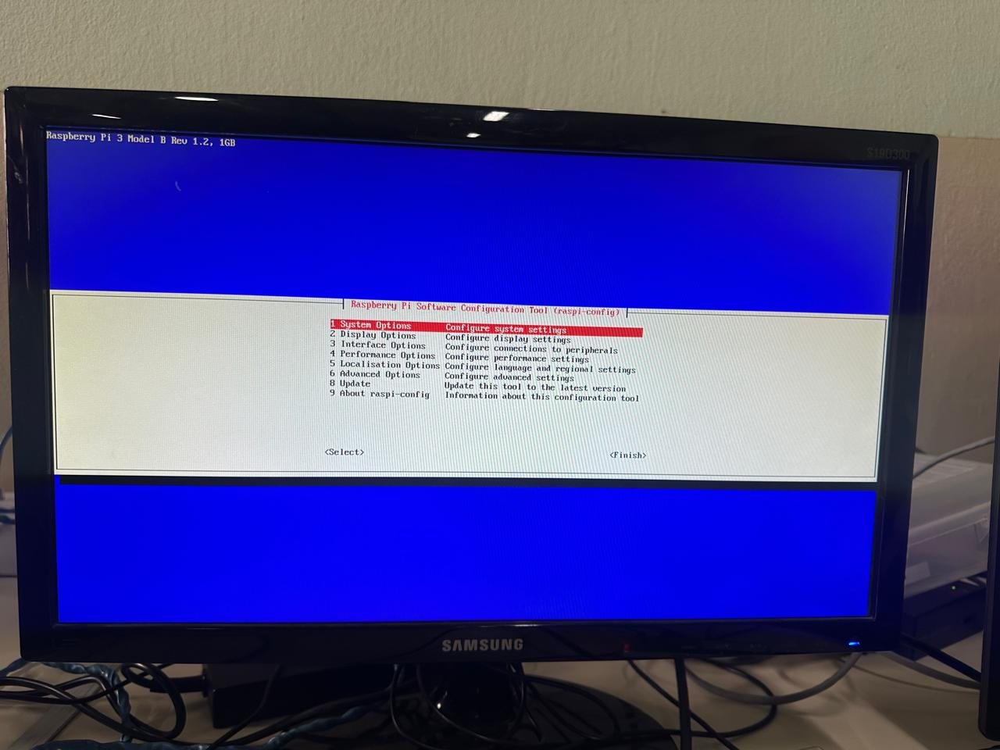
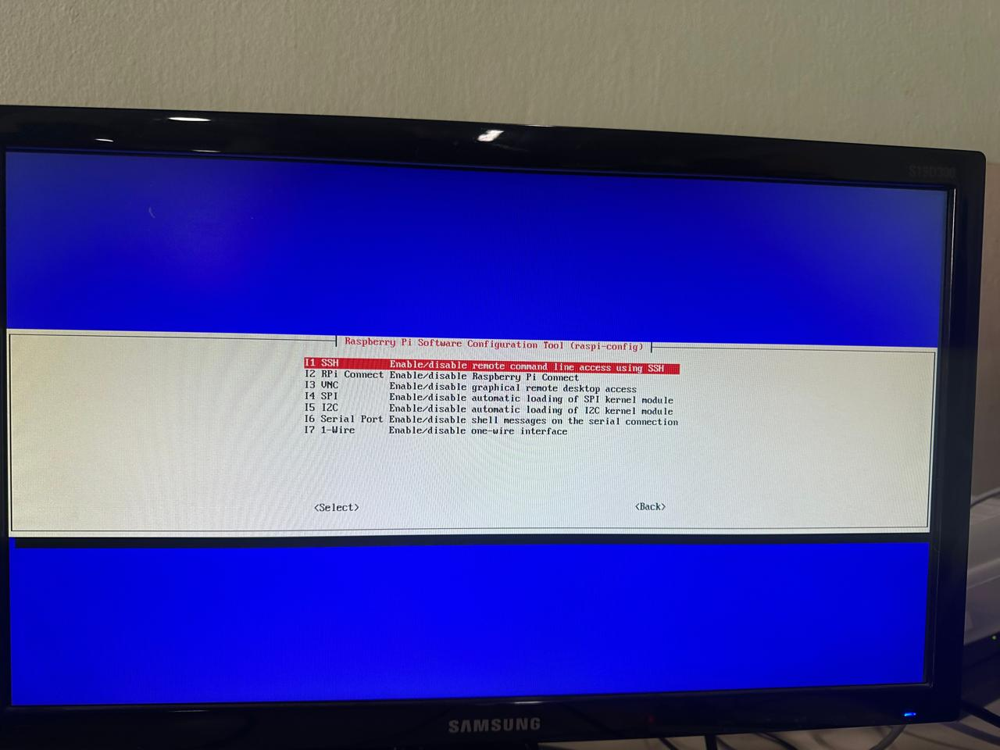
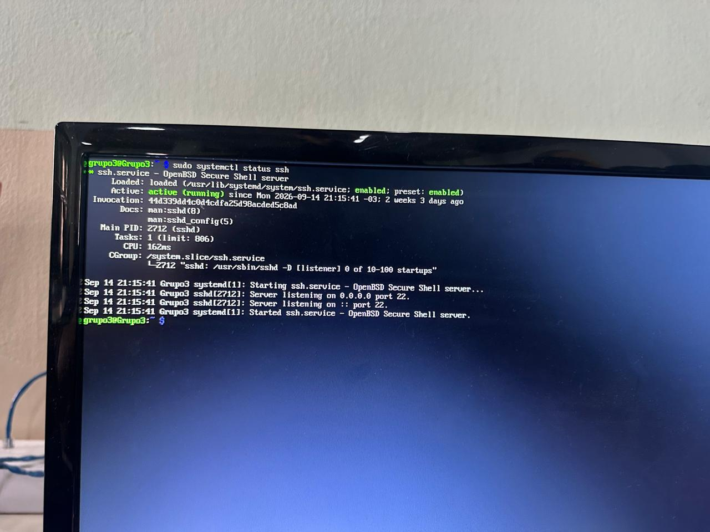

# Instalación de Raspberry Pi OS y configuración del servicio SSH

## Índice

- [Instalación de Raspberry Pi OS y configuración del servicio SSH](#instalación-de-raspberry-pi-os-y-configuración-del-servicio-ssh)
  - [Índice](#índice)
  - [Introducción](#introducción)
  - [Objetivo del informe](#objetivo-del-informe)
- [Desarrollo teórico](#desarrollo-teórico)
  - [Raspberry Pi](#raspberry-pi)
  - [Sistema operativo](#sistema-operativo)
  - [Raspberry Pi OS Lite](#raspberry-pi-os-lite)
  - [SSH](#ssh)
- [Instalación del sistema operativo](#instalación-del-sistema-operativo)
  - [Elementos utilizados](#elementos-utilizados)
  - [Preparación de la tarjeta microSD](#preparación-de-la-tarjeta-microsd)
  - [Configuración del usuario](#configuración-del-usuario)
  - [Inicio de la Raspberry Pi](#inicio-de-la-raspberry-pi)
- [Instalación y activación del servicio SSH](#instalación-y-activación-del-servicio-ssh)
  - [Configuración mediante `raspi-config`](#configuración-mediante-raspi-config)
    - [Explicación del comando](#explicación-del-comando)
  - [Verificación del servicio](#verificación-del-servicio)
    - [Explicación del comando](#explicación-del-comando-1)
- [Conclusión](#conclusión)

---

## Introducción

En este informe se documenta el proceso realizado para preparar una **Raspberry Pi** con el objetivo de utilizarla posteriormente como servidor dentro de una red local.

La actividad consistió en instalar desde cero un sistema operativo en una Raspberry Pi, utilizando una tarjeta microSD como unidad de almacenamiento, y posteriormente habilitar el servicio **SSH (Secure Shell)** para permitir conexiones remotas al dispositivo.

Para la instalación se utilizó **Raspberry Pi OS Lite (64-bit)**, una versión del sistema operativo que no incluye entorno de escritorio gráfico. Esto permite trabajar directamente desde la terminal y resulta apropiado para utilizar la Raspberry Pi como servidor.

El procedimiento realizado permitió dejar la Raspberry Pi iniciada correctamente y con el servicio SSH funcionando.

---

## Objetivo del informe

El objetivo de este informe es documentar el proceso de:

* Preparación e instalación del sistema operativo en una Raspberry Pi.
* Instalación de **Raspberry Pi OS Lite (64-bit)** sin entorno de escritorio.
* Configuración inicial del usuario.
* Inicio de la Raspberry Pi mediante la tarjeta microSD.
* Activación del servicio SSH.
* Comprobación del correcto funcionamiento del servicio SSH.

De esta manera, la Raspberry Pi queda preparada para ser utilizada posteriormente como servidor de distintos servicios dentro de una red local.

---

# Desarrollo teórico

## Raspberry Pi

Una **Raspberry Pi** es una computadora de pequeñas dimensiones que permite ejecutar un sistema operativo y utilizar diferentes servicios y aplicaciones.

En este trabajo se utilizó una **Raspberry Pi 3**, junto con una tarjeta microSD, fuente de alimentación, conexión HDMI y periféricos necesarios para realizar la configuración inicial.

Una de sus características principales es que puede utilizarse como un servidor de bajo consumo para proporcionar distintos servicios dentro de una red.

---

## Sistema operativo

El sistema operativo es el software principal que permite administrar los recursos de una computadora y proporciona una interfaz para ejecutar programas y servicios.

En una Raspberry Pi, el sistema operativo se almacena normalmente en una tarjeta microSD. Para este trabajo se utilizó **Raspberry Pi OS Lite (64-bit)**.

---

## Raspberry Pi OS Lite

**Raspberry Pi OS Lite** es una versión de Raspberry Pi OS orientada al trabajo mediante terminal y que no incluye un entorno de escritorio gráfico.

Esto es importante para este trabajo porque la consigna solicita instalar el sistema operativo **sin entorno de escritorio**.

Al trabajar mediante terminal se pueden administrar servicios, configurar la red y realizar tareas de administración del servidor sin necesidad de utilizar una interfaz gráfica.

---

## SSH

**SSH (Secure Shell)** es un protocolo que permite establecer conexiones remotas seguras con otro equipo a través de una red.

En este caso, SSH permite conectarse remotamente a la Raspberry Pi y utilizar su terminal sin necesidad de tener físicamente un teclado y monitor conectados al dispositivo.

El servicio SSH será especialmente importante en las siguientes etapas del proyecto, ya que permitirá administrar la Raspberry Pi de manera remota dentro de la red local.

---

# Instalación del sistema operativo

## Elementos utilizados

Para realizar la instalación se utilizaron los siguientes elementos:

* Raspberry Pi 3.
* Tarjeta microSD.
* Fuente de alimentación.
* Monitor.
* Teclado.
* Cable HDMI.
* Switch.
* Cables de red.
* Notebook para preparar la tarjeta microSD.
* Raspberry Pi Imager.
* Raspberry Pi OS Lite (64-bit).

El kit proporcionado incluía la Raspberry Pi 3, sus cables correspondientes, un switch y los cables necesarios para realizar la actividad.

---

## Preparación de la tarjeta microSD

El primer paso consistió en utilizar una tarjeta **microSD**, que funciona como unidad de almacenamiento de la Raspberry Pi.

La tarjeta microSD se conectó a una notebook para realizar la instalación del sistema operativo mediante **Raspberry Pi Imager**.

A través de este programa se seleccionó **Raspberry Pi OS Lite (64-bit)**, cumpliendo con el requisito de utilizar el sistema operativo sin entorno de escritorio.

---

## Configuración del usuario

Durante la instalación se configuró el usuario que posteriormente se utilizaría para ingresar al sistema.

El usuario utilizado durante la actividad fue:

```text
grupo3
```

También se estableció una contraseña para dicho usuario.

Esta configuración permite identificar al usuario que tendrá acceso al sistema operativo una vez iniciada la Raspberry Pi.

---

## Inicio de la Raspberry Pi

Una vez finalizada la instalación del sistema operativo, se retiró la tarjeta microSD de la notebook y se colocó en la Raspberry Pi.

Luego se conectó la fuente de alimentación y se esperó a que el dispositivo iniciara el sistema operativo.

Una vez completado el arranque, se accedió a la terminal de la Raspberry Pi, sin utilizar un entorno de escritorio gráfico.

---

# Instalación y activación del servicio SSH

## Configuración mediante `raspi-config`

Una vez iniciado el sistema operativo, el siguiente objetivo fue habilitar el servicio SSH.

Para realizar la configuración se utilizó el siguiente comando:

```bash
sudo raspi-config
```

### Explicación del comando

`sudo` permite ejecutar el comando con permisos administrativos.

`raspi-config` es una herramienta de configuración de Raspberry Pi que permite modificar diferentes opciones del sistema.

Por lo tanto:

```bash
sudo raspi-config
```

abre la herramienta de configuración con permisos administrativos.

Dentro de la interfaz se seleccionó la opción correspondiente a las interfaces, luego **SSH** y finalmente se habilitó el servicio seleccionando **Yes**.

De esta manera, SSH quedó habilitado en la Raspberry Pi.



> **Figura 1:** Activación del servicio SSH mediante `raspi-config`.



> **Figura 2:** Uno de los pasos durante la activación del SSH.

---

## Verificación del servicio

Después de habilitar SSH se verificó que el servicio estuviera funcionando correctamente.

Para realizar esta comprobación se utilizó:

```bash
sudo systemctl status ssh
```



> **Figura 3:** Se corre el código y esto devuelve la terminal.

### Explicación del comando

El comando `systemctl` permite consultar y administrar servicios del sistema.

En este caso:

* `sudo` ejecuta el comando con permisos administrativos.
* `systemctl` permite administrar los servicios del sistema.
* `status` solicita información sobre el estado actual de un servicio.
* `ssh` indica que el servicio que queremos consultar es SSH.

Por lo tanto:

```bash
sudo systemctl status ssh
```

permite consultar el estado actual del servicio SSH.

Como resultado de la comprobación, se observó que el servicio aparecía como **`active (running)`**, indicando que SSH se encontraba activo y funcionando correctamente.

---

# Conclusión

A partir de esta actividad se logró preparar una Raspberry Pi para su utilización como servidor dentro de una red local.

En primer lugar, se instaló **Raspberry Pi OS Lite (64-bit)** en una tarjeta microSD utilizando Raspberry Pi Imager, cumpliendo con el requisito de trabajar sin un entorno de escritorio gráfico.

Posteriormente, se configuró el usuario y se inició correctamente la Raspberry Pi desde la tarjeta microSD.

Finalmente, se habilitó el servicio **SSH** mediante `raspi-config` y se comprobó su funcionamiento utilizando `systemctl status ssh`. La comprobación mostró el estado **`active (running)`**, por lo que el servicio quedó funcionando correctamente.

Este procedimiento deja preparada la Raspberry Pi para las próximas etapas del proyecto, en las cuales podrá utilizarse como servidor para diferentes servicios dentro de la red local.
